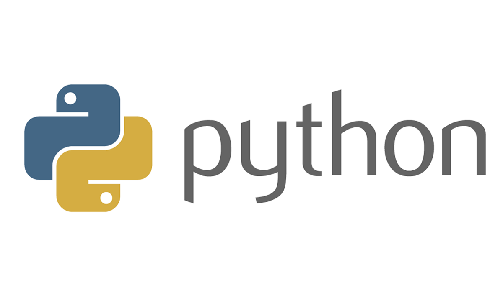

# **Словари**

## Что такое словарь?

> **Словарь** - в языке Python хранит *коллекцию элементов*, где каждый элемент имеет уникальный *ключ* и ассоциированое с ним некоторое *значение*.

$$ 
\int{\frac{dx}{a^2+x^2}=\frac{1}{a}\arctan\frac{x}{a}+C  (a\neq0)} 
$$ 

$$ 
\int{\frac{dx}{\sqrt{a^2\pm x^2}}}=\ln|{x+\sqrt{x^2\pm a^2}| + C}(a>0) 
$$

## Пример

~~~python
dictionary = {1: "Tom", 2: "Bob", 3: "Bill"}
print(dictionary[1])
~~~

## Методы словарей - 

> `dict.clear()` - очищает словарь.

> `dict.copy()` - возвращает копию словаря.

> `classmethod dict.fromkeys(seq[, value])` - создает словарь с ключами из seq и значением value (по умолчанию None).

> `dict.get(key[, default])` - возвращает значение ключа, но если его нет, не бросает исключение, а возвращает default (по умолчанию None).

> `dict.items()` - возвращает пары (ключ, значение).

> `dict.keys()` - возвращает ключи в словаре.

> `dict.pop(key[, default])` - удаляет ключ и возвращает значение. Если ключа нет, возвращает default (по умолчанию бросает исключение).

> `dict.popitem()` - удаляет и возвращает пару (ключ, значение). Если словарь пуст, бросает исключение KeyError. Помните, что словари неупорядочены.

> `dict.setdefault(key[, default])` - возвращает значение ключа, но если его нет, не бросает исключение, а создает ключ со значением default (по умолчанию None).

> `dict.update([other])` - обновляет словарь, добавляя пары (ключ, значение) из other. Существующие ключи перезаписываются. Возвращает None (не новый словарь!).

> `dict.values()` - возвращает значения в словаре.

